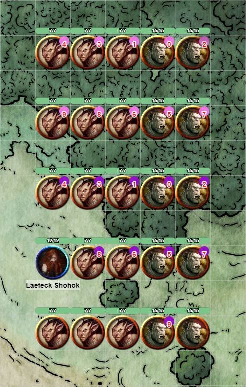
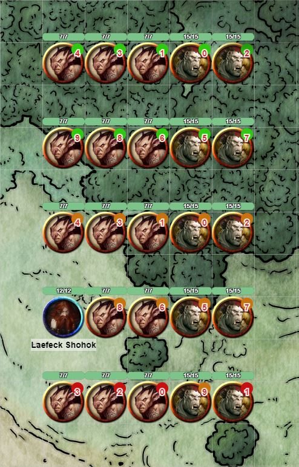

# aTMN
## Apply Token Marker Number script for Roll20

Source code at:
`https://github.com/TheKrakenCoder/aTMN`

This script is designed to be an easy way to mark a large amount of tokens so that players and GMs can easily refer to them in combat.  There are more powerful and more flexible scripts that do a similar thing (e.g. The Aaron’s TokenNameNumber script) but usually this script's functionality is all I need.  Plus, it gave me an excuse to write my first script.  The script applies a token marker with a numeral to selected tokens.  It can also remove the applied token markers.

### Applying Markers
The GM selects one or more tokens and then executes:

>!aTMN

By default, the first 20 tokens selected are marked.  The first ten tokens are marked with pink circles with numerals 0 through 9 and the next ten have purple circles with 0 through 9.  The manner in which roll20 decides the order of tokens is a mystery to me (maybe order in which they were created?).

Tokens that are controlled by someone, or represent a character that is controlled by someone, are not marked, and do not count towards the limit of 20.  This means you don’t have to avoid PCs when selecting tokens, and as long as important NPCs have the GM’s name in the “Can Be Edited & Controlled By” field, they won’t be marked either.

### Changing Markers
The GM can change the markers used to tag tokens by supplying a comma separated list of marker names.  For example:

>!aTMN green,brown

will make the first 10 markers green and the next 10 brown the next time the `!aTMN` command is run.  *This command does not actively mark tokens,* it changes the markers used the next time the `!aTMN` command is run.
 
The GM can list as many markers as he wants:
 
>!aTMN green,brown,red 

will mark up to 30 tokens, first green, then brown, then red the next time the `!aTMN` command is run.

### Removing Markers
To remove the markers, selected the desired tokens and execute:

>!aTMNX

Note the X at the end of the command.  There is no limit to the number of tokens that can have their markers removed with one command.  Note that if you apply pink and purple markers, then change the markers by using something like `!aTMN green,brown` then the next `!aTMNX` command will remove only green and brown markers.

If you have a bunch of tokens marked, you can select more tokens and mark them as well.  There will be duplicate markers in this case.  Applying new markers does not automatically remove old markers.  This duplicate marking is not a feature, but I’ve used this when there is a group in front of the PCs and another group behind and the chance for confusion is minimal.

### Summary
In summary, out of the box:

`!aTMN ` - For the first ten selected tokens, this applies a pink marker and puts a numeral from 0-9 in them.  The next ten tokens get a purple marker with a numeral.  Tokens after the 20th are ignored.

`!aTMNX` – Removes all markers currently used by aTMN (by default pink and purple) from all selected tokens.

`!aTMN marker1,marker2,…,markerN` – (e.g. red,green,yellow,purple) sets the markers aTMN uses to marker1,marker2,…,markerN.  The number of tokens that can be uniquely marked is 10 times the number of markers specified.
